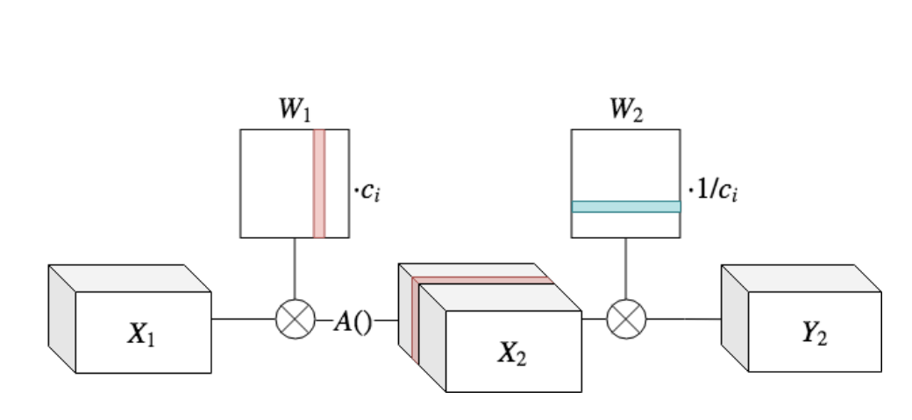

# Same, Same But Different
An Tensorflow.keras implementation of ICME2019 paper 
"Same, Same But Different - Recovering Neural Network Quantization Error Through Weight Factorization"(https://arxiv.org/pdf/1902.01917.pdf)

## Quick Start
This code has been tested on Ubuntu 18.04, Python 3.7, Tensorflow 2.0

- Clone this repository

        git clone https://github.com/Adamdad/Samesame.git 
 
- Network equalization

        python equalization.py
     
     In this code, I default equalize the _Inception_v3_ implemented by **keras.application** 

- Network visualization(in visual_weights_per_channel.py)
    - Per-channel convolution kernel weight visualization
            
            def visual_weight(model)
    - Per-channel activation feature map visualization
            
            def visual_activation(model,x)
    - Network architecture visualization
            
            def visual_graph(model,fig_name='model.png')

    
## Citation
    @article{meller2019same,
      title={Same, same but different-recovering neural network quantization error through weight factorization},
      author={Meller, Eldad and Finkelstein, Alexander and Almog, Uri and Grobman, Mark},
      journal={arXiv preprint arXiv:1902.01917},
      year={2019}
    }
